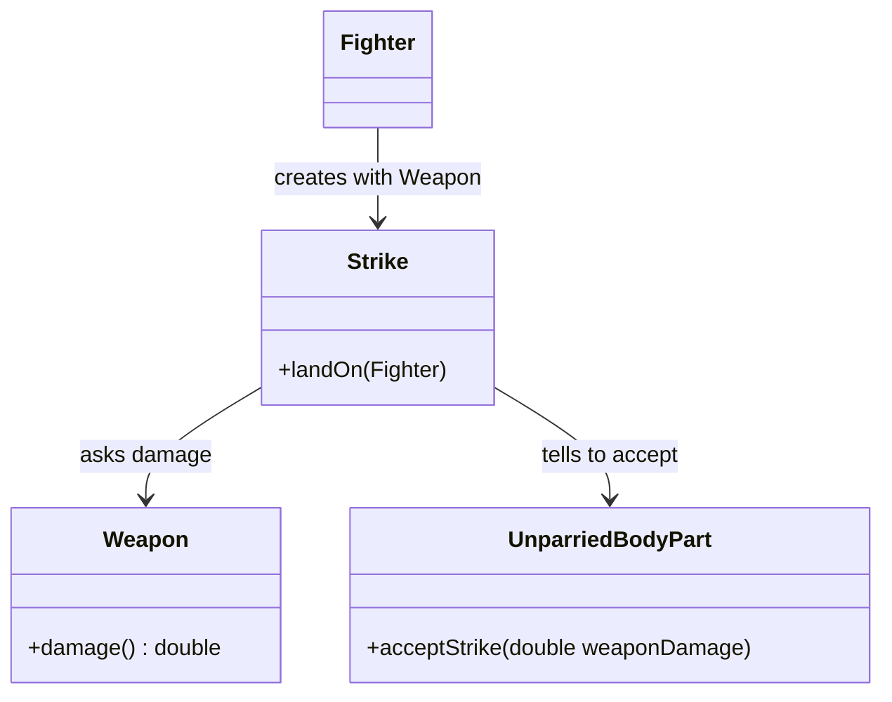

# Weapons

## Goals

1. Introduce Weapon as a new object that fighters wield.
2. Weapon calculates its damage (multiplier × critical multiplier if critical hit occurs).
3. Strike knows its weapon and asks it for damage when landing.
4. Unparried Body Part multiplies weapon damage by its base damage to determine final damage.

## Scenario description

A fighter wields a weapon. When the fighter creates a strike, the strike knows which weapon is used. When the strike lands on an unparried body part, the strike asks the weapon for its damage. The weapon decides if this is a critical hit (based on its critical chance) and returns its damage multiplier—or the multiplier times the critical multiplier if critical. The body part receives this weapon damage, multiplies it by its own base damage value, and tells its owner fighter to take that final damage.

## Design

### Diagram

### Implementation details

- Weapon.damage() decides internally if critical (using random chance against criticalChance field) and returns multiplier × criticalMultiplier if critical, otherwise just multiplier.
- Strike constructor accepts Weapon (passed by Fighter when creating Strike).
- Strike.landOn(Fighter) gets BodyPart from target, gets damage from Weapon, passes weapon damage to BodyPart.acceptStrike().
- UnparriedBodyPart.acceptStrike(weaponDamage) calculates: weaponDamage × baseDamage, tells owner to takeDamage().

## Tests to Implement (TDD)

- [x] Update existing tests to use weapons with multiplier 1.0 and 0% crit chance
  - Existing damage values (head=5, torso=3, legs=2) remain unchanged
- [x] weaponMultiplierAffectsDamage
  - Fighter with 2.0 multiplier weapon strikes opponent's head (base 5), opponent loses 10 HP
- [x] criticalHitDealsEnhancedDamage
  - Fighter with weapon (2.0 multiplier, 100% crit, 1.5 crit multiplier) strikes head (base 5), deals 15 damage

<!-- AI:DO-NOT-EDIT:BEGIN -->
# Next: 
- FightHistory
- Fight until death
- Scripts (story already done)
<!-- AI:DO-NOT-EDIT:END -->
