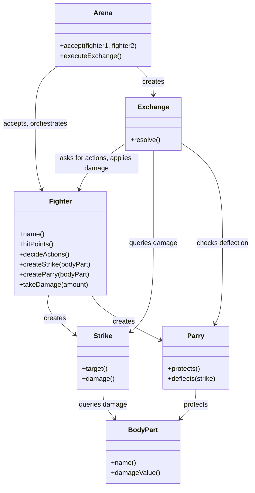

# Implementation Plan

## Goals

1. Two fighters enter Arena and execute simultaneous strike-and-parry exchange
2. Strikes land and deal body-part-specific damage unless blocked by matching parry
3. Fighters maintain hit points that decrease when struck successfully
4. Arena orchestrates the simultaneity of each exchange

## Scenario description

When Arena accepts two Fighters, it creates an Exchange to orchestrate their simultaneous actions. Each Fighter decides where to strike the opponent and which of their own body parts to parry. Fighter creates a Strike targeting one of the opponent's Body Parts (head, torso, or legs) and a Parry protecting one of their own Body Parts. Exchange asks each Fighter for their Strike and Parry, then resolves the exchange: it asks each Parry whether it deflects the incoming Strike by checking if the protected Body Part matches the Strike's target. When a Strike lands undeflected, Exchange asks the Strike how much damage it deals (by consulting its target Body Part's damage value) and tells the struck Fighter to take that damage to their hit points.

## Design

### Diagram

### Implementation details

- Fighters start with a defined number of hit points (e.g., 20)
- Body Part damage values: head = 5, torso = 3, legs = 2
- Parry deflects a Strike only when protected Body Part matches Strike's target Body Part
- Exchange resolution is atomic: both fighters' actions are collected before any damage is applied

## Tests

- [x] Fighter strikes opponent's head undefended and deals 5 damage
  - Aragorn strikes Boromir's head while Boromir parries his own legs
  - Boromir starts with 20 HP and ends with 15 HP
- [x] Fighter strikes opponent's torso undefended and deals 3 damage
  - Aragorn strikes Boromir's torso while Boromir parries his own head
  - Boromir starts with 20 HP and ends with 17 HP
- [x] Fighter strikes opponent's legs undefended and deals 2 damage
  - Aragorn strikes Boromir's legs while Boromir parries his own torso
  - Boromir starts with 20 HP and ends with 18 HP
- [x] Strike is deflected when fighter parries the targeted body part
  - Aragorn strikes Boromir's head while Boromir parries his own head
  - Both fighters end with 20 HP (no damage)
- [x] Both fighters strike each other successfully in simultaneous exchange
  - Aragorn strikes Boromir's head (5 damage) while parrying his own torso
  - Boromir strikes Aragorn's legs (2 damage) while parrying his own legs
  - Aragorn: 20 → 18 HP, Boromir: 20 → 15 HP

## Next
- See if it would be possible to refactor avoiding Exchange and have Fighters strike each other directly. Perhaps that will make Strike more active and not just a holder of properties.

