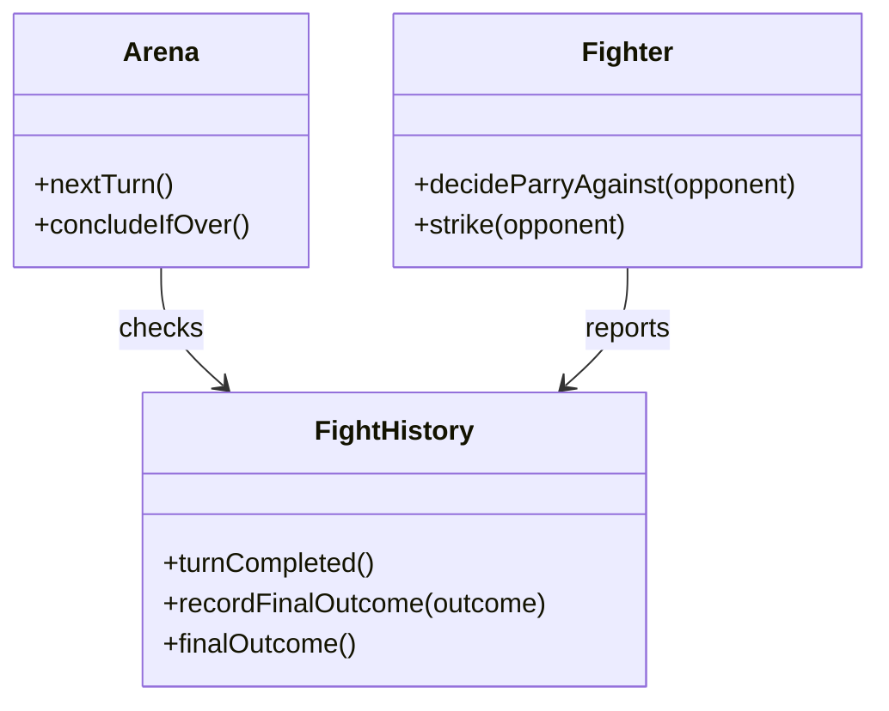

You are in the DESIGN PHASE for this project. Create a concrete implementation design from the narrative thick description and CRC cards before defining unit tests.

Inputs:
- ITERATION_FILE: {path-to-iteration-domain-doc}
- CRC_FILE: design/crc.md
- PLAN_FILE: plan.md

Task:
- Read ITERATION_FILE (narrative “thick description”) and CRC_FILE to understand rules and responsibilities relevant to this iteration.
- Write or update PLAN_FILE to flesh out the design sections before tests:
  - Goals: 1–4 concise, concrete outcomes for this iteration.
  - Scenario description: 2–6 sentences that narrate the intended behavior. It should be a story where actors are objects, and they collaborate with each other in order to fulfil the goals of this iteration.
  - Design → Diagram: a minimal Mermaid diagram that includes only the objects and responsibilities that will be added or modified in this iteration. If none are needed, state “No diagram needed for this iteration.”
  - Design → Implementation details: optional short bullets for specific notes that future code must honor. Often we won't need this.

Format and contents of PLAN_FILE:
- Format:
  - "# {Name of the current iteration}"
    - "## Goals"
    - "## Scenario description"
    - "## Design"
      - "### Diagram"
      - "### Implementation details"
- If needed, add additional sections or subsections.
- If the file is already filled (probably with a design from the previous iteration), clear it and start fresh, with the exception of the section at the end of the file marked with "AI:DO-NOT-EDIT". Always leave it at the end of the file.
- For the Design -> Diagram, draw a Mermaid diagram in one fenced block. Example:

Heuristics:
- Diagram shows only deltas (added/modified responsibilities) to keep focus tight.
- Implementation details capture invariants/edges that are easy to lose in prose.
- Align strictly with CRC responsibilities; do not invent APIs.

Output:
- Return the fully updated PLAN_FILE content only. No commentary outside the file content.

Checklist before returning:
- [ ] Goals are concise and concrete.
- [ ] Scenario description is short and written in domain language.
- [ ] Diagram, if exists, includes only added/modified objects/responsibilities.
- [ ] Implementation details included only if necessary.

